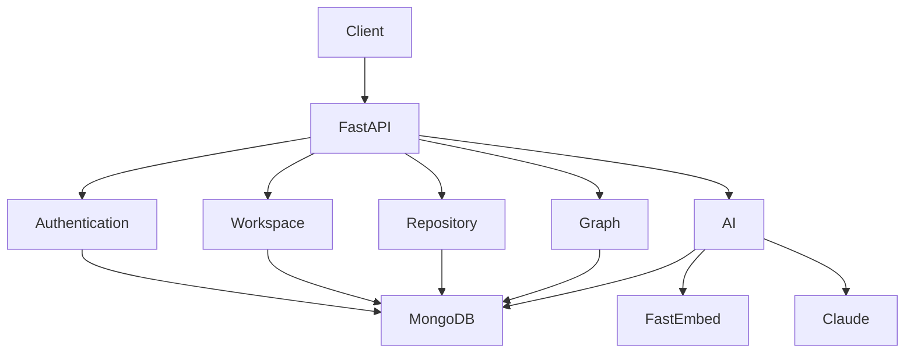

# Backend Architecture

## Purpose

This document provides a high-level overview of the CodeGanak backend architecture. It explains how requests move through the system, the responsibilities of each backend module, and the design decisions behind the current implementation.

This document is intended for contributors, reviewers, and developers who want to understand the backend before making changes.

---

# Backend Overview

The CodeGanak backend is built using **FastAPI** and follows a modular service-oriented architecture. The application exposes REST APIs for authentication, workspace management, repository ingestion, AI-powered repository understanding, semantic search, and architecture visualization.

Rather than placing all business logic inside API endpoints, the backend delegates responsibilities to dedicated service modules. This keeps request handlers lightweight while making the business logic easier to maintain and extend.

---

# Design Goals

The backend was designed with the following objectives:

* Modular service separation
* Clear responsibility boundaries
* AI-first repository analysis
* Stateless API endpoints using JWT authentication
* Scalable service organization
* Easy future expansion

---

# High-Level Architecture



---

# Layered Architecture

The backend follows a layered design:

```
Client
   │
   ▼
FastAPI API Layer (server.py)
   │
   ▼
Business Services
├── Authentication
├── Workspace
├── Repository
├── AI
└── Graph
   │
   ▼
Database Layer
```

Each layer has a clearly defined responsibility, reducing coupling between modules.

---

# Core Modules

## server.py

The application's entry point.

Responsibilities include:

* Initializing the FastAPI application
* Configuring middleware (such as CORS)
* Registering API routes
* Validating incoming requests
* Coordinating calls to backend services
* Returning API responses

Business logic is intentionally delegated to dedicated service modules rather than implemented directly inside route handlers.

---

## auth.py

Responsible for authentication and authorization.

Key responsibilities:

* Password hashing with bcrypt
* Password verification
* JWT creation
* User authentication
* Current-user resolution for protected endpoints

Authentication is stateless, allowing APIs to scale without server-side session storage.

---

## workspace_service.py

Handles collaborative workspace management.

Responsibilities include:

* Workspace creation
* Membership management
* Invitations
* Role handling
* Workspace access validation

This service acts as the collaboration layer of the platform.

---

## repo_service.py

Responsible for repository ingestion and processing.

Current capabilities include:

* ZIP repository import
* GitHub repository import
* Repository indexing
* File tree generation
* File retrieval

This service forms the entry point for repository analysis.

---

## ai_service.py

The intelligence layer of CodeGanak.

Responsibilities include:

* Repository-aware AI chat
* Semantic search
* Embedding generation
* Documentation generation
* LLM interaction

The service combines retrieval with AI reasoning to answer repository-specific questions.

---

## graph_service.py

Responsible for software structure visualization.

Responsibilities include:

* Dependency graph generation
* Architecture graph construction
* Relationship extraction

This service provides structured representations of repository components.

---

## db.py

Provides database connectivity and shared database access for backend services.

Keeping database configuration isolated simplifies maintenance and future migrations.

---

## models.py

Contains shared application models.

These models define:

* Request payloads
* Response schemas
* Domain entities

Using centralized models keeps API contracts consistent across the application.

---

# Request Lifecycle

A typical request follows this path:

1. Client sends an HTTP request.
2. FastAPI validates the request.
3. Authentication is performed if required.
4. The request is delegated to the appropriate service.
5. The service performs business logic.
6. Database operations are executed if needed.
7. A structured response is returned to the client.

This separation allows business logic to evolve independently from API routing.

---

# Security

Current security mechanisms include:

* JWT-based authentication
* Password hashing using bcrypt
* Protected endpoints through dependency injection
* Environment-based secret management

These mechanisms provide a solid foundation for secure API access.

---

# Scalability

The current modular structure supports future growth by allowing new services to be introduced without significantly affecting existing modules.

Potential future improvements include:

* Dedicated FastAPI routers
* Background task processing
* Repository processing queues
* Caching layer
* Observability and metrics

---

# Code References

* `backend/server.py`
* `backend/auth.py`
* `backend/workspace_service.py`
* `backend/repo_service.py`
* `backend/ai_service.py`
* `backend/graph_service.py`
* `backend/db.py`
* `backend/models.py`

---

# Design Decisions

* **Service-oriented organization** keeps business logic separate from API routing.
* **JWT authentication** enables stateless request handling.
* **Dedicated AI service** isolates AI functionality from core application logic.
* **Centralized models** ensure consistent request and response contracts.
* **Modular backend layout** makes the project easier to extend and maintain.

---

# Future Improvements

* Split `server.py` into dedicated route modules as the API surface grows.
* Introduce structured logging and request tracing.
* Add centralized exception handling.
* Expand automated testing coverage.
* Introduce dependency injection for service implementations.

This document serves as the architectural foundation for the remaining backend documentation.
