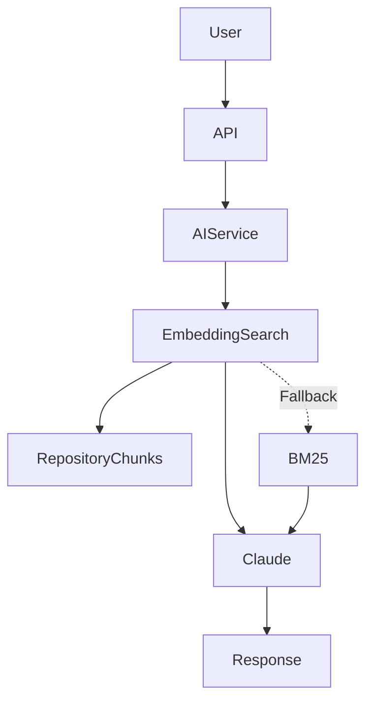

# AI Service

## Purpose

The AI Service is the intelligence layer of CodeGanak. It enables repository-aware conversations by combining semantic retrieval, local embedding generation, and large language model reasoning.

Rather than sending an entire repository to an LLM, the service first identifies the most relevant code and documentation, then uses that context to generate accurate, repository-specific responses.

---

# Overview

Implementation File:

```
backend/ai_service.py
```

The service combines three major capabilities:

1. Semantic retrieval using vector embeddings.
2. Keyword-based retrieval as a fallback mechanism.
3. Repository-aware conversational AI.

This hybrid design improves reliability while keeping inference efficient.

---

# Design Goals

The AI service was designed to:

* Understand software repositories rather than isolated files.
* Reduce unnecessary LLM context.
* Perform semantic retrieval locally.
* Continue functioning even if embeddings are unavailable.
* Separate retrieval from language generation.

---

# High-Level Workflow



---

# Core Responsibilities

## Semantic Embedding Generation

The service generates vector embeddings using:

* **Model:** `BAAI/bge-small-en-v1.5`
* **Runtime:** ONNX
* **Library:** FastEmbed

Embeddings are generated locally, avoiding external embedding APIs and reducing latency.

To improve performance, the embedder is initialized lazily. The model is loaded only when embeddings are first requested, which keeps application startup fast.

---

## Batch Processing

Embedding requests are processed in batches.

This reduces overhead when indexing repositories with many files while preventing excessive memory consumption.

The implementation also limits the maximum amount of text processed for each chunk, ensuring predictable resource usage.

---

## Semantic Search

For a user query:

1. The query is converted into an embedding.
2. Repository chunks are represented as embeddings.
3. Cosine similarity is computed.
4. The most relevant chunks are selected.
5. Those chunks become context for the language model.

This allows the AI to answer questions using repository-specific information instead of relying solely on pretrained knowledge.

---

## BM25 Fallback

If the embedding model cannot be loaded or embedding generation fails, the service automatically switches to a BM25-based keyword search.

This fallback strategy ensures that repository search remains available even when semantic retrieval is temporarily unavailable.

The fallback improves resilience without requiring changes to API consumers.

---

## Repository-Aware Chat

After relevant context has been retrieved, the service forwards the query and supporting repository information to the configured language model.

The language model is responsible for generating the final natural-language response, while retrieval remains the responsibility of the AI service.

This separation keeps the architecture modular and allows retrieval strategies or language models to evolve independently.

---

# Design Decisions

### Local Embeddings

Embedding generation is performed locally to reduce external dependencies and improve privacy.

### Lazy Initialization

The embedding model is loaded only when first needed, reducing application startup time.

### Retrieval Before Generation

Relevant repository context is selected before invoking the language model. This minimizes prompt size and improves response quality.

### Graceful Degradation

If semantic retrieval becomes unavailable, BM25 keyword search is used automatically, allowing the service to continue operating.

---

# Current Strengths

* Local embedding inference
* Efficient batch processing
* Semantic similarity search
* Automatic fallback strategy
* Repository-aware responses
* Clear separation between retrieval and generation

---

# Future Improvements

Potential enhancements include:

* Persistent vector index storage
* Incremental repository re-indexing
* Metadata-aware retrieval
* Hybrid ranking (semantic + keyword)
* Streaming retrieval pipelines
* Citation support linking responses to source files

---

# Code References

* `backend/ai_service.py`

This module forms the intelligence core of CodeGanak and provides the retrieval layer that powers repository-aware AI interactions.
