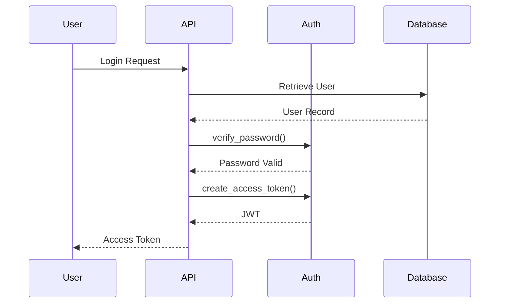
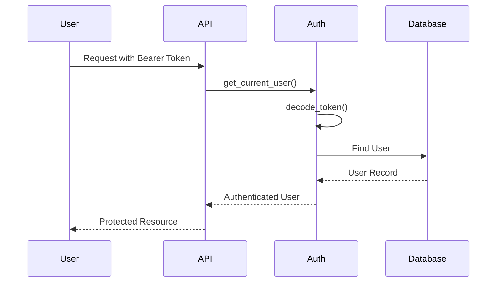

# Authentication Service

## Purpose

The Authentication Service is responsible for verifying user identity and securing access to protected resources within CodeGanak.

It provides password hashing, password verification, JWT generation, JWT validation, and authenticated user resolution. Rather than storing server-side sessions, CodeGanak uses stateless authentication with JSON Web Tokens (JWT), allowing the backend to scale without maintaining session state.

**Implementation File**

```
backend/auth.py
```

---

# Overview

The authentication module is intentionally small and focused. It does not contain API endpoints; instead, it exposes reusable functions and dependencies that are consumed by the FastAPI application.

Its primary responsibilities are:

* Secure password hashing
* Password verification
* JWT creation
* JWT validation
* Resolving the currently authenticated user
* Rejecting unauthorized requests

---

# Design Goals

The authentication service was designed with the following goals:

* Keep authentication logic isolated from API routes.
* Use stateless authentication.
* Store passwords securely using bcrypt.
* Protect endpoints through FastAPI dependency injection.
* Keep token validation centralized.

---

# Authentication Flow



---

# Protected Request Flow



---

# Core Components

## Password Hashing

Passwords are never stored in plain text.

The service hashes passwords using **bcrypt**, which automatically generates a unique salt for each password before hashing.

This protects user credentials even if the database is compromised.

---

## Password Verification

During login, the submitted password is compared against the stored bcrypt hash.

If verification fails for any reason, authentication is denied rather than exposing internal errors.

This defensive behavior prevents unexpected exceptions from leaking information.

---

## JWT Generation

After successful authentication, the service creates a signed JSON Web Token containing:

* User ID (`sub`)
* Email
* Expiration timestamp (`exp`)

The token is signed using the configured secret and algorithm, allowing the server to verify its authenticity without storing session state.

---

## JWT Validation

Every protected request passes through token validation.

The service:

1. Reads the Bearer token.
2. Verifies the signature.
3. Checks expiration.
4. Extracts the authenticated user's identity.

Invalid or expired tokens are rejected with an Unauthorized response.

---

## Current User Resolution

The `get_current_user()` dependency is the bridge between authentication and the rest of the backend.

Its responsibilities include:

* Reading the Authorization header
* Validating the JWT
* Looking up the user in the database
* Returning a sanitized public user model

Business services receive an authenticated user object instead of handling authentication themselves.

---

# Security Considerations

The current implementation includes several good security practices:

* Passwords are hashed using bcrypt.
* Plain-text passwords are never stored.
* JWT secrets are loaded from environment variables.
* Token expiration is enforced.
* Authentication failures return standardized HTTP 401 responses.
* Public user information is returned instead of exposing the complete database model.

---

# Dependencies

The authentication service relies on:

* bcrypt
* PyJWT
* FastAPI HTTPBearer
* MongoDB user collection
* Pydantic user models

---

# Design Decisions

### Stateless Authentication

JWTs eliminate the need for server-side session storage, making horizontal scaling simpler.

### Environment-Based Secrets

Secrets and authentication settings are read from environment variables rather than being hardcoded.

### Dependency Injection

Authentication is implemented as a FastAPI dependency (`get_current_user()`), allowing protected endpoints to reuse the same validation logic without duplication.

### Separation of Concerns

The authentication module handles identity verification only. Business rules remain within their respective services.

---

# Future Improvements

Potential enhancements include:

* Refresh token support
* Token revocation and blacklisting
* Role-based access control (RBAC)
* OAuth login providers (GitHub, Google)
* Multi-factor authentication (MFA)
* Audit logging for authentication events
* Rate limiting for login attempts

---

# Code References

* `backend/auth.py`

This module forms the security foundation of CodeGanak by providing reusable authentication primitives that are shared across protected backend services.
